# 📊 Exam System Implementation Flowchart

## 🎯 **Complete System Flow**

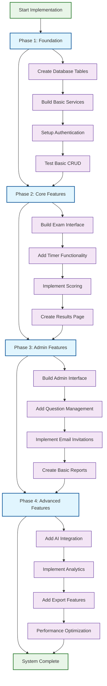

## 🏗️ **Database Design Flow**

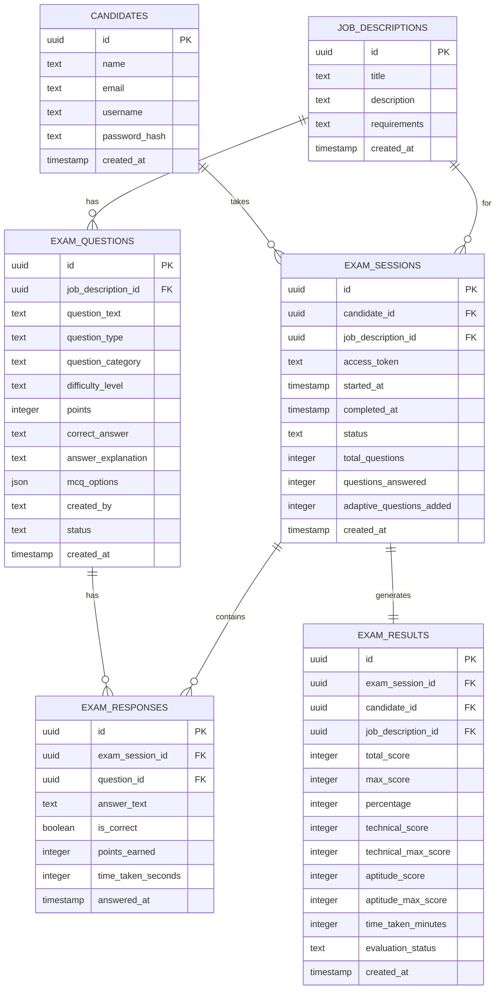

## 🔄 **Exam Taking Process Flow**

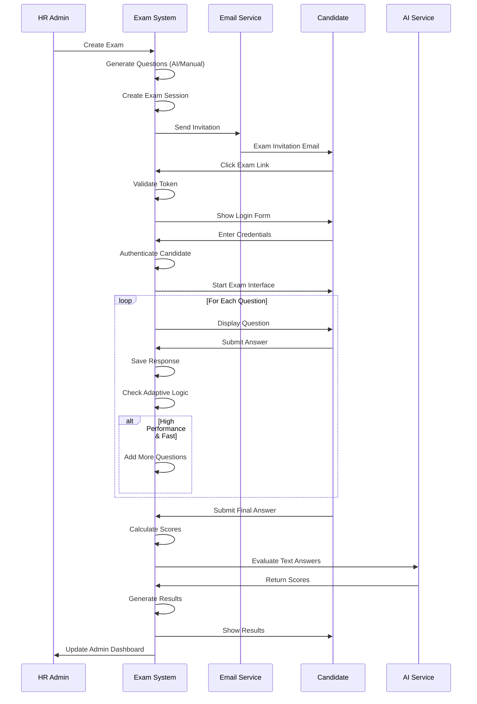

## 🎯 **HR Workflow Process**

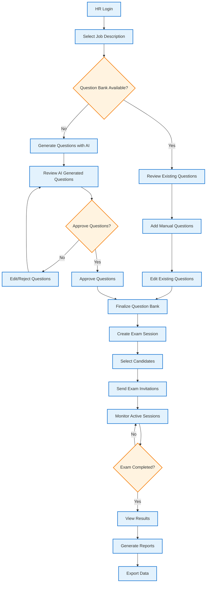

## 🔐 **Authentication & Security Flow**

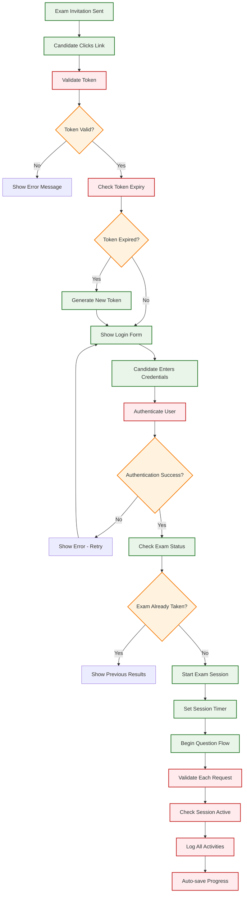

## 📊 **Adaptive Testing Logic Flow**

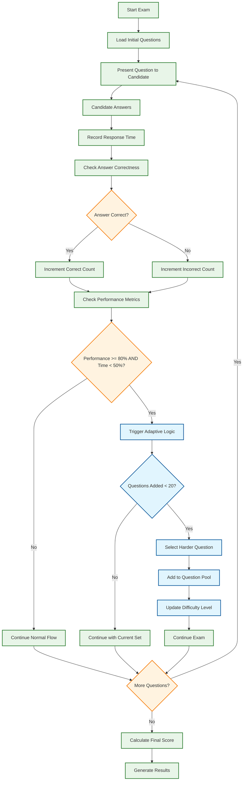

## 🎨 **Frontend Component Hierarchy**

```mermaid
graph TD
    A[App.tsx] --> B[Admin Routes]
    A --> C[Candidate Routes]
    
    %% Admin Routes
    B --> D[ExamManagementPage]
    B --> E[HRExamResultsPage]
    B --> F[QuestionBankPage]
    
    D --> D1[ExamCreationForm]
    D --> D2[QuestionSelector]
    D --> D3[SessionMonitor]
    
    E --> E1[ResultsTable]
    E --> E2[AnalyticsDashboard]
    E --> E3[ExportControls]
    E --> E4[ExamResultDetailModal]
    
    F --> F1[QuestionCard]
    F --> F2[QuestionEditor]
    F --> F3[AIQuestionGenerator]
    
    %% Candidate Routes
    C --> G[ExamLinkPage]
    C --> H[CandidateExamPage]
    C --> I[ExamResultsPage]
    
    G --> G1[TokenValidator]
    G --> G2[LoginForm]
    
    H --> H1[QuestionDisplay]
    H --> H2[AnswerInput]
    H --> H3[TimerComponent]
    H --> H4[ProgressBar]
    
    I --> I1[ScoreDisplay]
    I --> I2[CategoryBreakdown]
    I --> I3[PerformanceAnalytics]
    
    %% Styling
    classDef admin fill:#e3f2fd,stroke:#1976d2,stroke-width:2px
    classDef candidate fill:#e8f5e8,stroke:#2e7d32,stroke-width:2px
    classDef component fill:#f3e5f5,stroke:#7b1fa2,stroke-width:1px
    
    class B,D,E,F admin
    class C,G,H,I candidate
    class D1,D2,D3,E1,E2,E3,E4,F1,F2,F3,G1,G2,H1,H2,H3,H4,I1,I2,I3 component
```

## 🔧 **Service Architecture Flow**

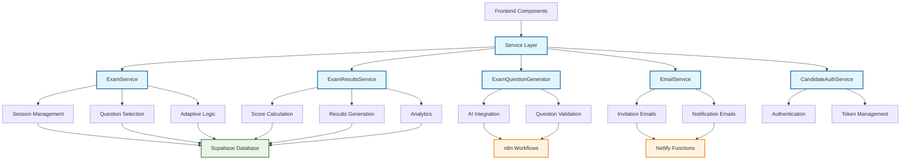

## 📈 **Implementation Timeline**

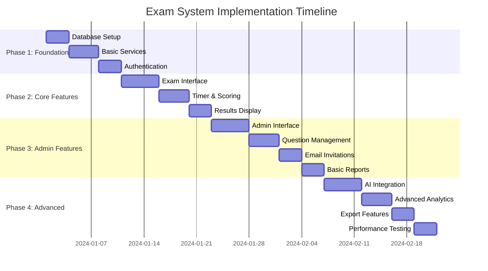

## 🔄 **Enhanced Question Generation Flow**

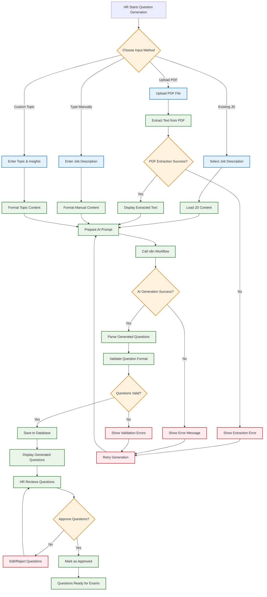

## 🎯 **Key Decision Points**

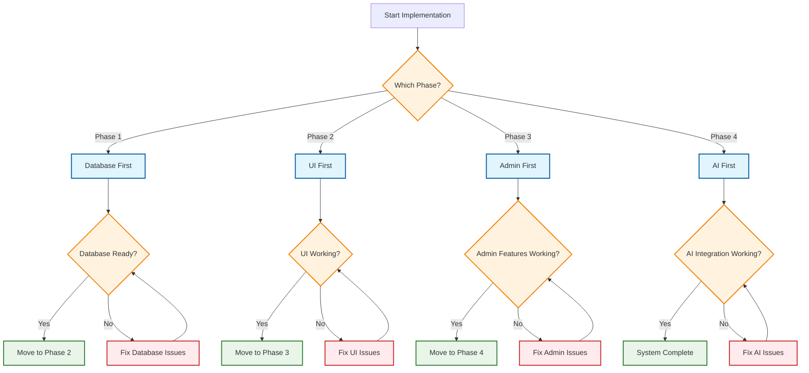

---

## 🚀 **How to Use These Flowcharts**

1. **Start with the Complete System Flow** - Understand the overall phases
2. **Review the Database Design** - Understand data relationships
3. **Follow the Exam Taking Process** - See the user journey
4. **Study the HR Workflow** - Understand admin processes
5. **Check Authentication Flow** - Ensure security understanding
6. **Review Adaptive Testing** - Understand the smart features
7. **Use the Timeline** - Plan your implementation schedule

These flowcharts provide a visual roadmap for implementing the exam system, making complex processes easier to understand and follow.
